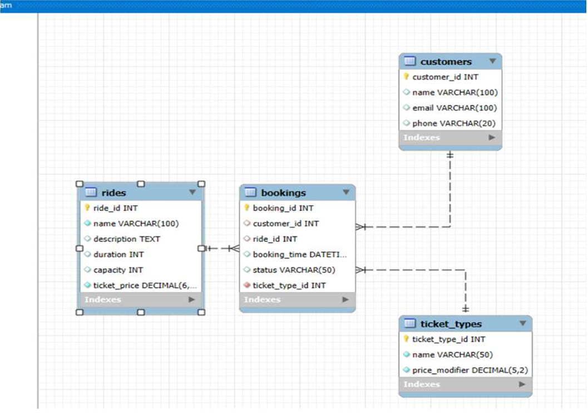

# AMUSEMENT PARK TICKET BOOKING SYSTEM

**Author:** Shruthi Ravi, Kavya Selvaraj, Anuj Banshal.

**Task:** To design and build a full-stack ticket booking system for an amusement park, where customers can select rides and book single or multiple tickets, and administrators can manage customer records, cancel bookings, and view analytics on ride popularity

**Framework:** Express (running on Node.js)

The Amusement Park Ticket Booking System streamlines how customers select rides and book tickets, and how administrators manage the park's operations. Customers can choose a ride, pick between single or multiple ticket bookings, and submit their details to complete a booking. Administrators can view a live, regularly updated feed of customer bookings, cancel bookings as needed, and monitor ride analytics based on how frequently each ride is chosen.

The system is backed by a relational MySQL database with a strictly defined schema and enforced relationships between rides, customers, ticket types, and bookings, ensuring transactional integrity, accurate ride-capacity tracking, and reliable analytics. All CRUD operations run through a Node.js/Express backend, with SQL queries handling validation, joins, and aggregation for reporting.

## FEATURES
### Customer's View
- [x] Browse available rides and ticket types
- [x] Book single or multiple tickets per ride
- [x] Submit customer details as part of booking

### Administrator View
- [x] View a live, continuously updated list of customer bookings
- [x] Cancel existing bookings
- [x] View ride analytics (booking frequency per ride) to identify popular attractions

### System
- [x] Relational schema enforcing data integrity across rides, customers, ticket types, and bookings
- [x] Accurate ride-capacity tracking via enforced relationships
- [x] Aggregated SQL queries powering the analytics dashboard

## TECH STACK
| LAYER              | TECHNOLOGY |
|--------------------|-----------:|
| Backend            | Node.js, Express 4     |
| Database           | MySQL (via mysql2 driver)    |
| Middleware         | cors, body-parser |
| Frontend           | JavaScript, HTML, CSS (some TypeScript)|

## DATA MODEL
The database schema centers on four core entities:
+ Customers --> customer details captured at booking time
+ Rides --> ride information managed by administrators
+ Ticket Types --> single vs. multiple ticket options
+ Bookings --> links customers, rides, and ticket types; tracks status (active/cancelled)

Enforced foreign key relationships between these tables keep booking data consistent and make ride-capacity and analytics queries reliable.

## EER DIAGRAM

